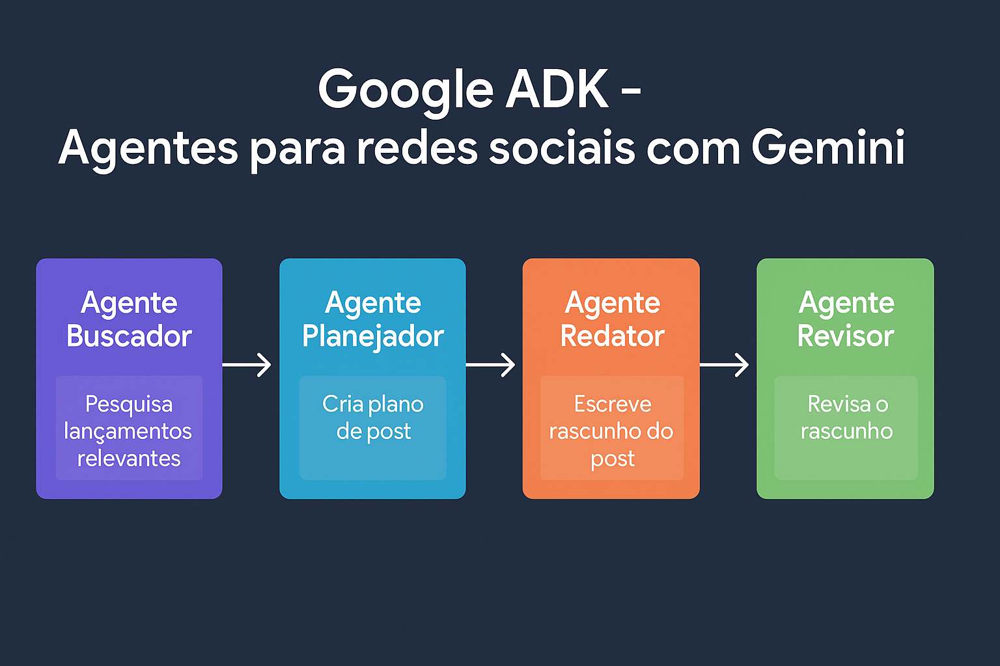

# Sistema Multi-Agente (Google ADK & Gemini) para criação de posts de Instagram

Este repositório contém um script Python que utiliza o Google Agent Development Kit (ADK) e modelos Gemini para criar posts para o Instagram de forma automatizada, baseados em um tópico fornecido pelo usuário. O sistema emprega uma arquitetura multi-agente, onde cada agente tem uma responsabilidade específica no processo de criação de conteúdo.

## 🚀 Descrição resumida

O objetivo deste projeto é simplificar e automatizar o processo de criação de conteúdo para redes sociais, especificamente para o Instagram. Dado um tópico de interesse, o sistema:

1.  **Pesquisa:** Busca as notícias e lançamentos mais recentes e relevantes sobre o tópico.
2.  **Planeja:** Analisa os resultados da pesquisa, identifica os pontos mais importantes e cria um plano de conteúdo para um post.
3.  **Escreve:** Gera um rascunho de post para o Instagram, seguindo o plano e adotando um tom engajador e informativo.
4.  **Revisa:** Avalia o rascunho quanto à clareza, concisão, correção e adequação ao público-alvo, sugerindo melhorias ou aprovando para publicação.

<p align="center">
  
</p>

## 🧠 Fluxo detalhado dos Agentes

O sistema opera como uma linha sequencial de agentes onde cada agente contribui com sua especialidade:

1.  **Agente Buscador (`agente_buscador`):**
    *   **Entrada:** O tópico buscado pelo usuário e a data de hoje.
    *   **Tarefa:** Usa `google_search` para encontrar até 5 notícias/lançamentos muito relevantes e recentes (último mês) sobre o tópico.
    *   **Saída:** Uma lista formatada desses lançamentos/notícias.

2.  **Agente Planejador (`agente_planejador`):**
    *   **Entrada:** O tópico buscado pelo usuário e a lista de lançamentos buscada pelo Agente Buscador.
    *   **Tarefa:** Usa `google_search` para pesquisar mais sobre os lançamentos, identifica os pontos mais relevantes para abordar em um post, escolhe o tema mais promissor e cria um plano detalhado para o post.
    *   **Saída:** O tema escolhido, seus pontos-chave e o plano do post.

3.  **Agente Redator (`agente_redator`):**
    *   **Entrada:** O tópico buscado pelo usuário e o plano detalhado gerado pelo Agente Planejador.
    *   **Tarefa:** Escreve um rascunho de post para Instagram, seguindo o plano, usando linguagem engajadora e simples e incluindo hashtags.
    *   **Saída:** O rascunho do post.

4.  **Agente Revisor (`agente_revisor`):**
    *   **Entrada:** O tópico buscado pelo usuário e o rascunho gerado pelo Agente Redator.
    *   **Tarefa:** Revisa o rascunho verificando clareza, concisão, correção gramatical e tom (adequado para público jovem, 18-30 anos).
    *   **Saída:** Aprovação ("O rascunho está ótimo e pronto para publicar!") ou feedback com sugestões de melhoria.

## 🛠️ Tecnologias Utilizadas

*   **Python:** Linguagem de programação principal.
*   **Google Agent Development Kit (ADK):** Framework para construir e orquestrar agentes de IA.
    *   `Agent`: Define o comportamento e as ferramentas de cada agente.
    *   `Runner`: Executa os agentes e gerencia o fluxo de interação.
    *   `InMemorySessionService`: Gerencia o estado da conversa na memória.
    *   `google_search`: Ferramenta integrada para realizar buscas na web.
*   **Google Gemini API:** Acesso aos modelos de linguagem da Google (`gemini-2.0-flash`, `gemini-2.5-pro-preview-03-25`).
*   **Google Colab:** Ambiente de notebook recomendado para execução (devido ao uso de `userdata` e `IPython.display`).
*   **Bibliotecas:** `os`, `google.colab.userdata`, `google.adk`, `IPython.display`, `warnings`, `datetime`, `textwrap`.

## ⚙️ Instalação e Configuração

1.  **Clonar o Repositório (Opcional):**
    ```bash
    git clone <URL_DO_SEU_REPOSITORIO>
    cd <NOME_DO_REPOSITORIO>
    ```
    *Observação:* Se estiver rodando diretamente no Google Colab, você pode simplesmente criar um novo notebook e colar o código.

2.  **Instalar Dependências:**
    A principal dependência é o `google-adk`. Execute a célula no notebook que contém:
    ```python
    !pip install -q google-adk
    ```

3.  **Configurar a API Key:**
    *   No Google Colab, vá até a seção "Secrets" (ícone de chave no painel esquerdo).
    *   Crie um novo secret chamado `GEMINI_API_KEY`.
    *   Cole sua API Key do Google Gemini no campo "Value".
    *   Certifique-se de que a opção "Notebook access" esteja habilitada para este secret.
    *   O script usará `userdata.get('GEMINI_API_KEY')` para buscar a chave com segurança, e irá setá-la como chave de ambiente em `os.environ["GOOGLE_API_KEY"]`.

## ⚠️ Observações

*   **Custos da API:** O uso das APIs do Google Gemini pode incorrer em custos dependendo do volume de uso. Consulte a [política de preços do Gemini](https://ai.google.dev/pricing).
*   **Qualidade da Saída:** A qualidade dos resultados depende da capacidade dos modelos Gemini, da precisão dos resultados da busca do Google e da clareza do tópico fornecido. Optei por escolher um modelo menor e mais rápido (`gemini-2.0-flash`) para as partes de busca de informações, e um modelo mais poderoso (`gemini-2.5-pro-preview-03-25`) para a geração e revisão do post.
*   **Dependências Externas:** O funcionamento correto depende da disponibilidade e performance das APIs do Google (Gemini e Search).
*   **Adaptação:** As instruções (`instruction`) de cada agente podem ser modificadas para ajustar o comportamento, o tom ou o foco do sistema.
